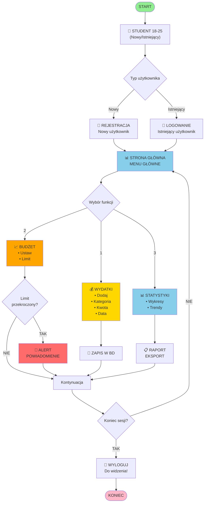
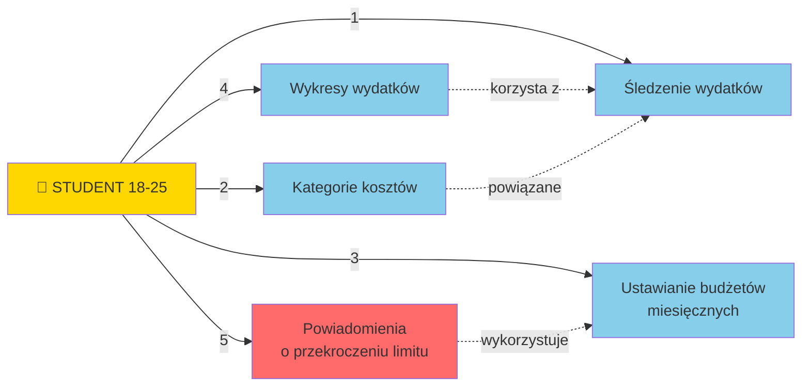

Diagram przypadków użycia: Aplikacja do zarządzania budżetem studenckim
(odbiorcy: osoby 18–25 lat)
DIAGRAM FLOWCHART - PRZEPŁYW GŁÓWNYCH OPERACJI

                              * START *
                                  |
                                  v
                      +---------------------------+
                      |  STUDENT 18-25            |
                      |  (Nowy/Istniejący)        |
                      +---------------------------+
                                  |
                    +--------------+---------------+
                    |                              |
                    v                              v
          +--------------------+      +--------------------+
          | REJESTRACJA        |      | LOGOWANIE          |
          | Nowy uzytkownik    |      | Istniejacy uzyt.   |
          +----------+---------+      +----------+---------+
                     |                           |
                     +----------+-----------+----+
                                |
                                v
                    +========================+
                    | STRONA GLOWNA          |
                    | - MENU GLOWNE -        |
                    +========================+
                                |
           +--------------------+--------------------+
           |                    |                    |
           v                    v                    v
    +------------------+ +------------------+ +------------------+
    | WYDATKI          | | BUDZET           | | STATYSTYKI       |
    |                  | |                  | |                  |
    | Dodaj            | | Ustaw            | | Wykresy          |
    | Kategoria        | | Limit            | | Trendy           |
    | Kwota            | |                  | |                  |
    | Data             | |                  | |                  |
    +--------+---------+ +-------+----------+ +--------+---------+
             |                   |                    |
             v                   v                    v
        +--------+          +--------+            +--------+
        | ZAPIS  |          | LIMIT? |            | RAPORT |
        | W BD   |          +---+----+            | EKSPORT|
        +---+----+              |                 +---+----+
            |               TAK | NIE                 |
            |                   v                     |
            |            +----------+                |
            |            | ALERT    |                |
            |            | POWIADOM.|                |
            |            +----+-----+                |
            |                 |                      |
            +-----------------+----------------------+
                              |
                              v
                       +------------------+
                       | KONIEC SESJI?    |
                       +-------+----------+
                               |
                            TAK|
                               v
                       +------------------+
                       | WYLOGUJ          |
                       | (Do widzenia!)    |
                       +--------+---------+
                                |
                                v
                           * KONIEC *

    Psy strzegace wydatkow:
    
         ^__^                ^__^                ^__^
         (oo)\_______        (oo)\_______        (oo)\_______
         (__)\       )\/\    (__)\       )\/\    (__)\       )\/\
             ||----w |          ||----w |          ||----w |
             ||     ||          ||     ||          ||     ||

Relacje istotne (przykładowe):
 - Powiadomienia o przekroczeniu limitu -> wykorzystuje -> Ustawianie budżetów miesięcznych
 - Wykresy wydatków -> korzysta z -> Śledzenie wydatków
 - Kategorie kosztów -> powiązane ze Śledzeniem wydatków

Uwagi:
 - Cechy kluczowe: śledzenie wydatków, kategorie, budżety miesięczne, wykresy, powiadomienia.
 - Odbiorcy: młodzi użytkownicy 18–25 lat chcący oszczędzać i planować wydatki.

