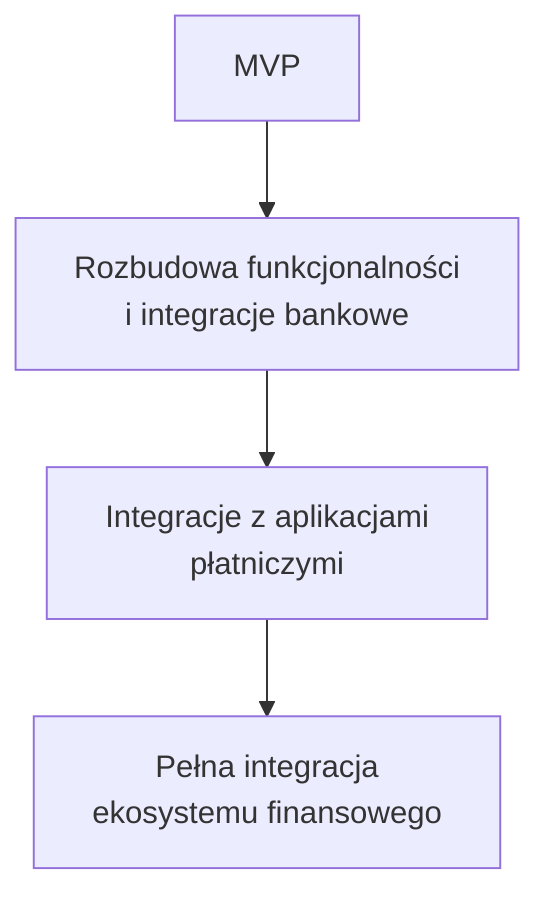
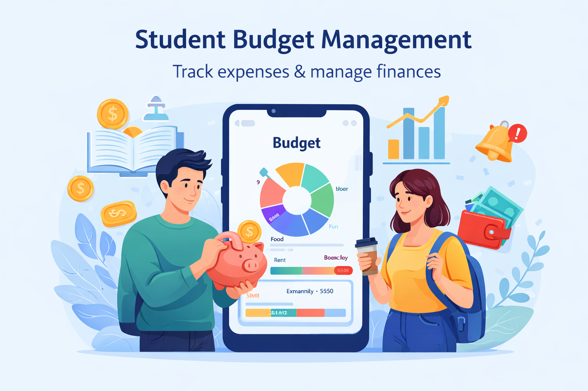

# Projekt dotyczy aplikacji do zarządzania budżetem studenckim i uświadamiania wydatków. 
*Rozwiązuje problem niekontrolowanego wydawania pieniędzy i braku przehlądu finansów wśród młodzieży. 
Odbiorcą są osoby 18–25 lat, które chcą oszczędzać i planować swoje wydatki. 
Na pewno znajdą się: śledzenie wydatków, kategorie kosztów, ustawianie budżetów miesięcznych, wykresy wydatków, powiadomienia o przekroczeniu limitu.*

## **ROZSZERZONY OPIS**

>Aplikacja będzie udostępniać interfejs przyjazny dla użytkownika, umożliwiający szybkie dodawanie wydatków i przeglądanie historii transakcji. Główne funkcjonalności obejmują:

1. Śledzenie wydatków - szczegółowe rejestrowanie każdego wydatku z data, kategorią, kwotą i opcjonalnym opisem.

2. System kategorii - możliwość definiowania i dostosowywania kategorii wydatków (jedzenie, transport, rozrywka, edukacja, mieszkanie itp.) do indywidualnych potrzeb użytkownika.

3. Budżety miesięczne - ustawianie limitów wydatków dla każdej kategorii lub na całkowity budżet miesięczny z możliwością śledzenia postępu.

4. Wizualizacja danych - wykresy słupkowe i kołowe pokazujące rozkład wydatków po kategoriach oraz trendy zmian wydatków w czasie.

5. Powiadomienia - automatyczne alerty gdy wydatki w danej kategorii zbliżą się do ustalonego limitu lub go przekroczą.

6. Historia i raport - możliwość przeglądania szczegółowej historii wydatków, filtrowania po datach i kategoriach oraz eksportowania raportu.

7. Statystyki - wyświetlanie przeciętnych wydatków, oszczędności osiągnięte w danym miesiącu, porównanie wydatków między miesiącami.

Aplikacja będzie responsywna, dostępna na urządzeniach mobilnych i stacjonarnych, z intuicyjnym interfejsem wymagającym minimalnego czasu nauki. Dane będą bezpiecznie przechowywane z możliwością synchronizacji między urządzeniami użytkownika.

**DODATKOWE FUNKCJONALNOŚCI:**

| Cele oszczędnościowe | Porównanie wydatków | Powtarzające się wydatki | Mulitwalutowość | Notatki i tagi|
|---|---|---|---|---|
| możliwość ustalania długoterminowych celów finansowych (wyjazd, sprzęt, mieszkanie) z śledzeniem postępu i szacowanym czasem ich osiągnięcia | analiza porównawcza własnych wydatków z przeciętną dla danego wieku lub grupy społecznej (anonimowe dane statystyczne) | automatyczne dodawanie regularnych wydatków (czynsz, abonament, ubezpieczenie) bez konieczności ręcznego wprowadzania każdego miesiąca | obsługa różnych walut dla studentów studiujących za granicą z automatyczną konwersją kursów | możliwość dodawania opisów i etykiet do wydatków ułatwiających kategoryzację i przeszukiwanie |

**TECHNOLOGIA I BEZPIECZEŃSTWO:**

>Aplikacja zostanie zbudowana na nowoczesnym stosie technologicznym z wykorzystaniem frontend (React/Vue.js) i backend (Node.js/Python). Baza danych będzie zabezpieczona szyfrowniem SSL/TLS. Aplikacja będzie posiadać funkcję dwustopniowej autentykacji dla zwiększenia bezpieczeństwa kont. Dane użytkowników będą przechowywane zgodnie z RODO i innymi normami ochrony prywatności.

## **ANALITYKA I UCZENIE SIĘ:**

Aplikacja będzie uczyć się preferencji użytkownika i na podstawie historii wydatków sugerować optymalizację budżetu. Będą dostępne poradniki i artykuły edukacyjne dotyczące finansów osobistych i oszczędzania. Użytkownik będzie mógł porównać swoje wydatki z wcześniejszymi okresami i zobaczyć obszary, w których może zaoszczędzić.

### **COMMUNITY I WSPÓŁDZIELENIE:**

- Opcjonalne 
  - funkcje społeczne pozwalające użytkownikom dzielić się strategiami oszczędzania (anonimowo)
  - otrzymywać inspirację od innych. 
- Możliwość
  - tworzenia wspólnych budżetów dla studentów mieszkających razem,
  - śledzenia wspólnych wydatków (czynsz, media)

PLAN WDRAŻANIA:

